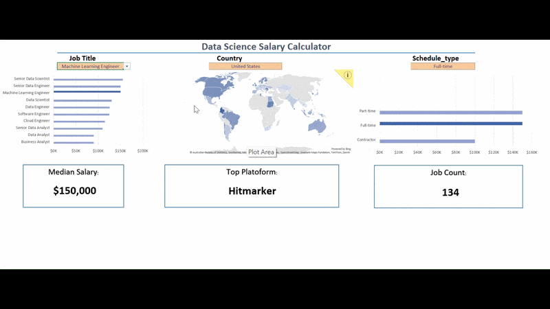
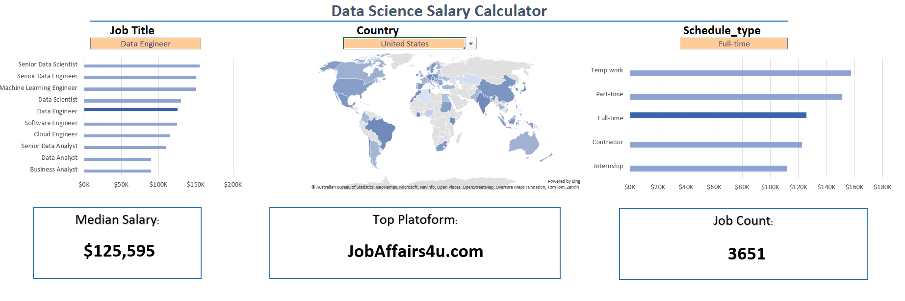

# 📊 Data Science Salary Dashboard

## 🎥 Dashboard Demo



## Overview

The **Data Science Salary Dashboard** is an interactive Microsoft Excel dashboard designed to help users explore and compare salaries across different data-related job roles. Using dynamic filters and advanced Excel functions, the dashboard allows users to analyze salary trends based on job title, country, and employment type.

This project demonstrates advanced Excel skills, dashboard design principles, and data analysis techniques used in real-world business reporting.

---

## Dashboard Preview

> Replace the image above with a screenshot of your dashboard.

```
Project Folder
│
├── Salary_Dashboard.xlsx
├── README.md
└── images
    └── dashboard.png
```

---

## Features

- Interactive salary analysis
- Dynamic Job Title selection
- Country filter
- Employment Type filter
- Automatic salary calculations
- Professional dashboard layout
- Error handling for missing data
- Protected dashboard interface for end users

---

## KPIs

The dashboard automatically calculates:

- Median Salary
- Average Salary
- Maximum Salary
- Minimum Salary

These metrics update instantly whenever a user changes the dashboard filters.

---

## Skills Demonstrated

### Microsoft Excel

- Advanced Formulas
- Dynamic Arrays
- Data Validation
- Named Ranges
- Dashboard Design
- Error Handling
- Cell Protection
- Conditional Formatting

### Excel Functions Used

- XLOOKUP
- FILTER
- MAXIFS
- MINIFS
- AVERAGEIFS
- MEDIAN
- SEARCH
- ISNUMBER
- IF
- IFERROR
- INDEX
- MATCH
- LARGE
- SUMPRODUCT

---

## Dashboard Filters

Users can interact with the dashboard using:

| Filter | Description |
|---------|-------------|
| Job Title | Select a Data Science role |
| Country | Compare salaries across countries |
| Schedule Type | Filter by employment type (Full-time, Part-time, Contractor, etc.) |

---

## Dataset

The dashboard uses a real-world Data Science jobs dataset containing information such as:

- Job Title
- Salary
- Country
- Job Schedule Type
- Hiring Platform
- Company Information

---

## Project Objectives

The primary goals of this project were to:

- Practice advanced Excel techniques
- Build an interactive business dashboard
- Improve data visualization skills
- Create a portfolio-ready analytics project
- Demonstrate dashboard development best practices

---

## What I Learned

During this project I strengthened my understanding of:

- Interactive dashboard design
- Data cleaning and preparation
- Dynamic filtering techniques
- Building scalable Excel reports
- Writing efficient Excel formulas
- Improving dashboard usability and user experience

---

## Files Included

| File | Description |
|------|-------------|
| Salary_Dashboard.xlsx | Interactive Excel Dashboard |
| README.md | Project Documentation |
| dashboard.png | Dashboard Screenshot |

---

## Future Improvements

- Add Power Query for automated data refresh
- Build a Power BI version
- Include salary trend visualizations
- Add slicers for additional filtering
- Connect to external datasets

---

## Author

**Riyan Ahmed**

Aspiring Data Analyst | Excel | SQL | Python | Data Visualization

---

## Screenshot

Replace this placeholder with your dashboard image.


